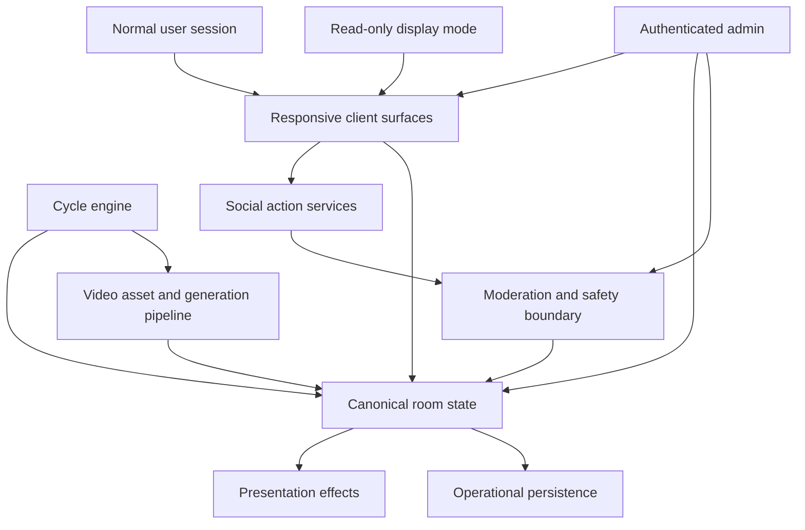

# Architecture Plan: Strange Dreamz

## Purpose

This document defines the first durable architecture plan for Strange Dreamz: Living Video Panel. It translates `docs/plans/PRD_V0.md` and `docs/plans/initial-roadmap.md` into technical boundaries, subsystem responsibilities, and implementation sequencing without selecting a concrete technology stack.

The architecture is intentionally product-led and stack-neutral. The next implementation slice still needs to select the initial application stack, establish validation commands, and name the first executable failing test before product code is written.

## Source Of Truth

- Product requirements: `docs/plans/PRD_V0.md`
- Implementation roadmap: `docs/plans/initial-roadmap.md`
- Video latency research: `docs/plans/video-generation-latency-research.md`

## Architecture Goals

- Preserve the PRD's one canonical shared room for MVP while keeping the room model extensible for future multiple-room support.
- Make fast social feedback independent from slow video replacement.
- Keep lifecycle, action limits, moderation, admin controls, and recovery rules testable as domain behavior rather than UI side effects.
- Support three presentation surfaces from one room state: interactive big screen, interactive small screen, and read-only display mode.
- Treat MVP fake generation and V1 real generation as implementations behind the same pipeline boundary.
- Keep ephemerality explicit: persist live operational state, avoid creating a user-facing archive, and expire social state at sleep.
- Preserve operational safety through admin controls, visible failure states, release runbooks, and smoke checks before deployment.

## MVP Operating Envelope

The first stack decision must prove it can carry one canonical room in a shared-building context. These numbers are Phase 0 stack-selection gates, not a public-scale launch promise.

| Field | Expected MVP Target | Stress Gate For Stack Selection |
| --- | --- | --- |
| Interactive clients | 40 concurrent browser sessions acting in one room | 150 concurrent browser sessions in one room |
| Unattended display clients | 2 display-mode clients | 8 display-mode clients |
| Sustained room mutations | 2 accepted user or admin mutations per second for a full 5-minute cycle | 8 accepted mutations per second for a 60-second burst |
| Final Surge burst | 5 accepted mutations per second during the final 30 seconds before Lock-In | 15 accepted mutations per second for 30 seconds |
| Snapshot fanout latency | p95 under 500 ms from accepted mutation to visible update on connected clients | p95 under 1500 ms during burst load |
| Countdown/phase drift | Visible phase and countdown stay within 1 second of authoritative room time | Drift recovers to under 1 second within 5 seconds after burst load |
| Reconnect | Refresh or temporary network loss restores the current snapshot within 3 seconds without duplicating actions | Restores within 10 seconds without duplicated actions or stale action eligibility |

Graceful degradation should follow this order:

1. Reduce transient overlay density and animation intensity.
2. Batch non-critical activity-feed and Murmur presentation updates.
3. Lower decorative presentation effects and non-essential metrics refresh.
4. Preserve four-pane video visibility, authoritative room state, action-limit enforcement, moderation outcomes, admin controls, and visible safety states.

The first behavior allowed to degrade under load is non-critical spectacle: overlay frequency, animation intensity, and feed presentation density. The video wall, canonical snapshot, phase eligibility, accepted mutations, and safety/admin controls must not be the first degraded capabilities.

## Non-Goals

- This plan does not choose the web framework, database, realtime transport, hosting target, storage provider, moderation provider, or AI video provider.
- This plan does not introduce multiple rooms for MVP.
- This plan does not add durable normal user accounts, share pages, public archives, full chat, or real AI generation to MVP.
- This plan does not replace `docs/plans/PRD_V0.md` as the product source of truth.

## System Context

This illustrates the intended architecture shape and is directional guidance for review, not implementation specification. The implementing agent should treat it as context, not code to reproduce.

## Subsystem Design Documents

- `docs/plans/technical-designs/room-state-and-cycle-engine.md`
- `docs/plans/technical-designs/responsive-clients-and-presentation.md`
- `docs/plans/technical-designs/identity-actions-and-social-inputs.md`
- `docs/plans/technical-designs/moderation-admin-and-safety.md`
- `docs/plans/technical-designs/video-assets-and-generation-pipeline.md`
- `docs/plans/technical-designs/persistence-retention-and-recovery.md`
- `docs/plans/technical-designs/operations-release-and-validation.md`

## Key Architectural Decisions

### One canonical room state, not independent client state

All interactive and display surfaces observe the same room state: panes, cycle phase, themes, boosts, pane votes, genome, murmurs, activity, lineage, admin availability, and safety controls. Clients may project that state differently, but they must not own divergent domain rules.

Rationale: The PRD defines the room as one shared organism. Shared state protects collective authorship, display mode parity, and recovery behavior.

### Functional boundaries before service boundaries

The first architecture names subsystem boundaries without deciding whether they become modules, packages, server routes, workers, queues, or separate services.

Rationale: The roadmap says the stack and deployment target are not selected. Premature service decomposition would invent implementation commitments before the first useful slice exists.

### Cycle state is a first-class domain lifecycle

Submission Window, Boost Frenzy, Final Surge, Lock-In, Emergence Theater, and Emergence should be modeled as named phases with explicit transitions and configurable timing.

Rationale: Most product behavior depends on phase-specific eligibility, action limits, presentation intensity, lock-in, and replacement timing. Time logic must be testable without relying on wall-clock flakiness.

### Fast feedback is separate from video readiness

Votes, boosts, murmurs, rankings, overlays, genome movement, and social callouts update immediately. Video emergence is interval-based and may use a ready clip whose prompt locked in an earlier cycle.

Rationale: This preserves the PRD thesis that slow generation can still feel alive when the social game is fast.

### MVP fake generation and V1 real generation share a pipeline boundary

MVP should select from a pre-generated Strange Dreamz clip pool through the same conceptual pipeline that V1 later extends with provider calls, moderation, storage, readiness, delay, backup, and recovery states.

Rationale: The roadmap explicitly protects MVP from premature provider integration while the PRD requires V1 latency resilience.

### Moderation has two distinct gates

Visible surface moderation decides whether handles, themes, and murmurs may appear to other users. Generation safety moderation decides whether a prompt may be sent to a video provider.

Rationale: The PRD allows socially acceptable prompts that may still be ineligible for generation. The architecture must preserve that distinction.

### Admin controls override live behavior visibly

Admin availability, action pauses, panic controls, manual emergence, cycle skips, and effect settings must affect the live room immediately and surface user-facing explanations when relevant.

Rationale: The MVP requires a minimal live admin panel and panic controls that can recover from bad live content without silent failure.

### Ephemeral product state, durable operational recovery

The system should persist what is needed to operate the live room and recover from short failures, while expiring handles, counters, active themes, boosts, murmurs, and cycle state at sleep.

Rationale: Strange Dreamz is daily and perishable as an experience, but not fragile operationally.

### Product learning without a public archive

The system should derive aggregate product-learning metrics from operational domain events without creating user-facing history. Metrics should help evaluate whether the social organism works: active users per cycle, actions per active user, Final Surge participation, prompt lead changes, users staying through a cycle, display-mode joins, and later provider cost per engaged minute.

Rationale: MVP is meant to prove the social organism. Without aggregate learning, the team could ship mechanics without knowing whether the room feels alive.

### V1 social mechanics are separate from provider integration

V1 real-generation work must not consume all V1 planning space. Before V1 is claimed complete, pane votes need a social-mechanics decision such as survival, protection, or an equivalent mechanic that makes beloved panes matter beyond MVP genome influence.

Rationale: The PRD describes V1 as real generation plus richer social mechanics and production readiness. Provider integration alone does not satisfy that product direction.

## Conceptual State Model

| Area | MVP Responsibility | Sleep Boundary |
| --- | --- | --- |
| Room availability | Awake/unavailable state, countdown, admin override | Availability continues by configured schedule |
| Panes | Four active videos, positions, names/personas, traits, influence | Final four active videos persist |
| Cycle | Phase, countdown, eligible/incubating themes, lock-in, emergence | Expires; wake resumes without special ceremony |
| Actions | Submissions, boosts, pane votes, action counters | Expire |
| Identity | Browser session plus handle pair | Expire |
| Social surfaces | Murmurs, echoes, activity feed, overlays | Mostly expire |
| Lineage | Compact emergence credit needed for pane display | Persist only as needed for current active panes |
| Product metrics | Aggregates derived from domain events | Persist only as aggregate operational learning |
| Video pool | Seed/generated clips and trait metadata | Persist as operational asset pool |
| Admin config | Hours, limits, effects, seed pool, panic settings | Persist |

## Stack Selection Decision Frame

The first implementation plan should not merely pick a framework. It should record:

- required capabilities: authoritative shared room state, realtime fanout, deterministic time testing, responsive/browser workflow testing, secure session-backed mutations, admin auth, media asset serving, operational logging, and deployable smoke checks;
- candidate options and rejection criteria, including what would make a candidate fail the MVP operating envelope above;
- the smallest proof: render the deterministic four-panel wall, connect at least two interactive clients plus one display-mode client to one room snapshot, mutate shared state from one client, and observe the update everywhere without live provider calls;
- the validation commands and CI shape that will become canonical in `AGENTS.md`;
- what evidence would falsify the selected stack before later slices depend on it.

## Delivery Sequencing

1. Define the stack-selection decision frame, MVP operating envelope, and canonical validation commands.
2. Build a deterministic four-panel shell from seed data.
3. Establish a minimal cycle and phase-eligibility contract before building phase-dependent social actions.
4. Establish a minimal project-specific seed pool and trait metadata contract; keep generic stand-ins developer-only.
5. Implement session handles, theme submissions, boosts, pane votes, murmurs, and activity as behavior-tested social actions.
6. Add full cycle advancement, lock-in, prompt mutation, lineage, and oldest-pane replacement from the pre-generated pool.
7. Add daily availability, recovery behavior, display mode, admin controls, and panic-state client contracts.
8. Add aggregate product-learning metrics from domain events without a public archive.
9. Harden operations with release identity, smoke checks, documented rollback expectations, log retention, and secrets handling.
10. Plan V1 social mechanics and provider integration after the fake-generation loop is testable and useful.

## First Implementation Slice

The Phase 0 stack-selection plan now exists. The current first implementation slice is to complete `docs/plans/initial-stack-decision.md` by selecting the initial application stack, recording candidates and rejection criteria, and naming the exact deterministic shell test path before product code is written.

First failing test to name before product code is written:

> An executable expectation that the app can render the core four-panel video wall shell from deterministic seed data and expose the same room snapshot to an interactive client and a read-only display client.

Closest useful validation before stack selection:

- Review this architecture plan and subordinate design docs for product alignment.
- Confirm that every future implementation slice has a subsystem boundary and first failing test expectation to draw from.

## Open Architecture Decisions

- Initial application stack.
- Database and persistence model.
- Realtime transport.
- Auth/session mechanism for normal users and admins.
- Moderation provider or local moderation model.
- Seed video asset format and hosting.
- Minimal project-specific seed pool size, trait coverage, reuse policy, and launch gate.
- Aggregate product metrics and retention boundaries.
- Deployment target.
- CI and canonical validation commands.
- V1 pane survival/protection or equivalent social mechanic.
- V1 AI video provider, storage/CDN model, concurrency, and timeout thresholds.

## Documentation Freshness

Update this document when any of the following become durable:

- The initial stack or deployment target is selected.
- Data model or realtime transport boundaries are established.
- Provider, storage, moderation, or authentication decisions are made.
- Multiple-room support becomes implementation scope.
- Product scope in `docs/plans/PRD_V0.md` changes.
- Operational runbooks in `docs/operations/` define release identity, smoke checks, or rollback behavior.
