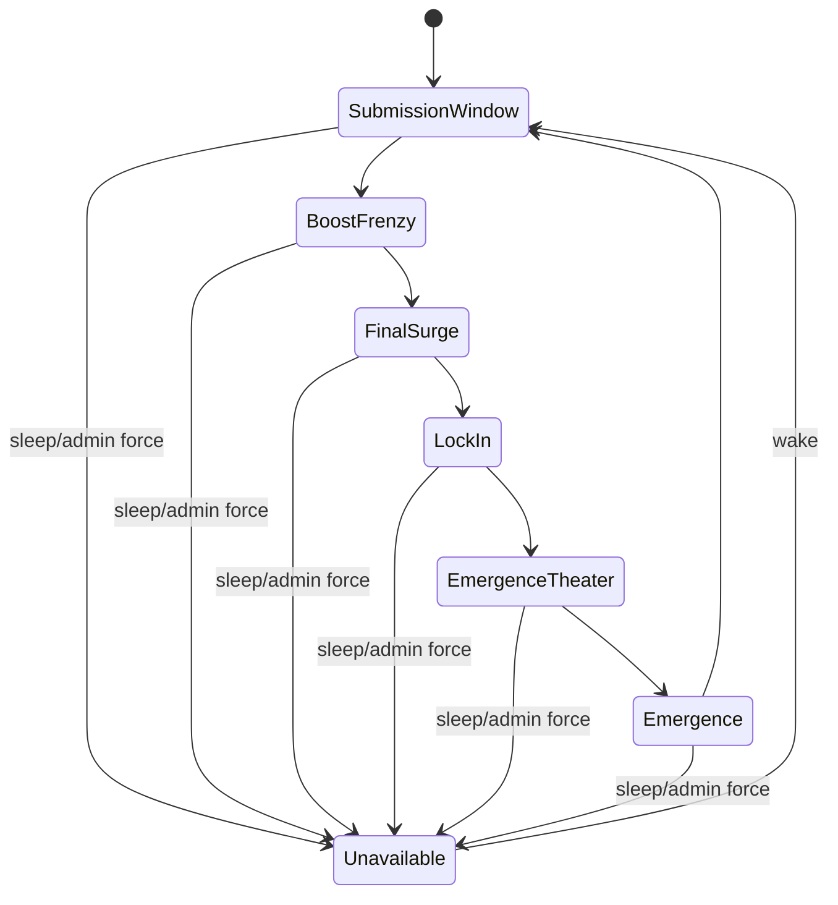

# Technical Design: Room State And Cycle Engine

## Purpose

Define the lifecycle and state contract for the canonical Strange Dreamz room, including cycle phases, theme eligibility, lock-in, emergence, daily availability, and extension points for future multiple-room support.

## Product Requirements Covered

- One canonical shared room for MVP.
- All clients observe and affect the same active room state.
- Default 5-minute cycle with named phases.
- Current-cycle submissions, incubating themes, boosts, pane votes, lock-in, emergence theater, and emergence.
- Oldest-pane replacement in MVP.
- Daily awake/unavailable rhythm from 10am to 11pm local time by default.
- Sleep expires handles, counters, active themes, boosts, cycle state, and murmurs while preserving final active videos.
- Recovery event when cycle state cannot be recovered.

## Design Principles

- Treat room state as the domain source of truth; clients render projections.
- Make time explicit and injectable for tests.
- Keep phase transitions deterministic.
- Keep phase-specific action eligibility close to the cycle engine, not scattered across UI surfaces.
- Model MVP as one canonical room using a single room namespace or constant. Avoid room-scoped routes, user-facing room switching, multi-room admin surfaces, or persistence branching until a later slice explicitly adopts multiple rooms.

## Conceptual Responsibilities

| Responsibility | Notes |
| --- | --- |
| Room availability | Awake, unavailable by schedule, forced unavailable by admin |
| Cycle clock | Current phase, phase boundaries, remaining time, configured cycle length |
| Theme lifecycle | Submitted, incubating, eligible, locked, lost, expired |
| Lock-in | Selects a winner according to phase and generation-eligibility rules and captures social credit |
| Emergence | Replaces the oldest pane with a ready MVP clip or later V1 candidate |
| Genome input | Receives pane influence state for prompt mutation and preview |
| Recovery | Restores operational room state or starts a clean cycle with visible event |

## Phase Model

This illustrates the intended lifecycle shape and is directional guidance for review, not implementation specification.

## State Boundaries

- The cycle engine owns phase eligibility and transition timing.
- Social action services own whether a specific user/session may act, then ask the cycle engine whether that action is phase-eligible.
- The presentation layer may intensify during Final Surge or Emergence Theater but must not change the domain phase.
- The video pipeline may report readiness, delay, backup, or failure, but the cycle engine decides when an emergence slot occurs.
- Admin controls may override availability or freeze/skip cycle state.

## Interrupt Precedence And Idempotency

The cycle engine must define a single ordering for interrupts before admin controls ship. The default precedence is:

| Priority | Event | Intended effect |
| --- | --- | --- |
| 1 | Sleep boundary or forced unavailable | Stop the room immediately, expire day-scoped social state as applicable, and show unavailable state. No pending emergence should pretend to complete. |
| 2 | Cycle freeze | Hold the current phase and countdown. User actions remain governed by any active action pauses and the current phase. |
| 3 | Action pauses | Override normal eligibility for handles, submissions, or murmurs without changing the current phase. |
| 4 | Manual emergence | Succeeds only when a ready MVP clip or V1 candidate exists; otherwise the admin action is visibly rejected or left pending by an explicit implementation decision. |
| 5 | Cycle skip | Advances out of the current cycle through an admin-visible event. If a theme is already locked, the implementation plan must specify whether the locked prompt is preserved, absorbed, or discarded before this control ships. |
| 6 | Provider or seed readiness | Updates generation readiness but does not itself advance the cycle outside an emergence slot or manual emergence. |
| 7 | Scheduled phase transition | Advances only when no higher-priority interrupt blocks it. |
| 8 | User action | Applies only after session, action-limit, moderation, pause, and phase checks pass. |

Every transition should be idempotent: retrying the same sleep, freeze, skip, lock-in, emergence, provider-readiness, or recovery event must not duplicate credit, consume extra action counters, replace multiple panes, or emit contradictory visible events.

## First Failing Tests For Future Slices

- Phase eligibility: given the cycle is in Submission Window, a current-cycle theme submission is accepted; given Submission Window has ended, a new submission becomes incubating for the next cycle.
- Lock-in: given lock-eligible themes with boost totals at Lock-In, the highest-ranked lock-eligible theme locks and receives immediate credit.
- Emergence: given an emergence slot and a ready MVP seed clip, the oldest pane is replaced and the new pane becomes active.
- Sleep boundary: given sleep time arrives mid-cycle, the room becomes unavailable immediately and per-day social state expires.
- Interrupt precedence: given sleep time arrives during Lock-In or Emergence Theater, sleep wins and no replacement is falsely presented as completed.
- Admin idempotency: given an admin freeze, skip, or manual emergence request is retried, room state changes at most once and emits one coherent visible event.
- Recovery: given current cycle state cannot be recovered after restart, a clean cycle starts and the room emits "The organism reassembled itself."

## Validation Expectations

- Unit or domain tests should cover deterministic phase transitions without wall-clock sleeps.
- Workflow tests should prove clients see the same canonical phase and room state after transitions.
- Recovery tests should distinguish recoverable current-day state from expired sleep-boundary state.

## Open Decisions

- Concrete time abstraction and scheduler model.
- Data persistence shape for cycle snapshots and transition events.
- Whether cycle advancement runs in-process, through a background worker, or through external scheduling.
- Tie-breaking rule for ranked themes when boost totals match.
- Exact cycle-skip semantics for already locked prompts and pending lineage.

## Sources

- `docs/plans/PRD_V0.md`
- `docs/plans/initial-roadmap.md`
- `docs/plans/ARCHITECTURE.md`
