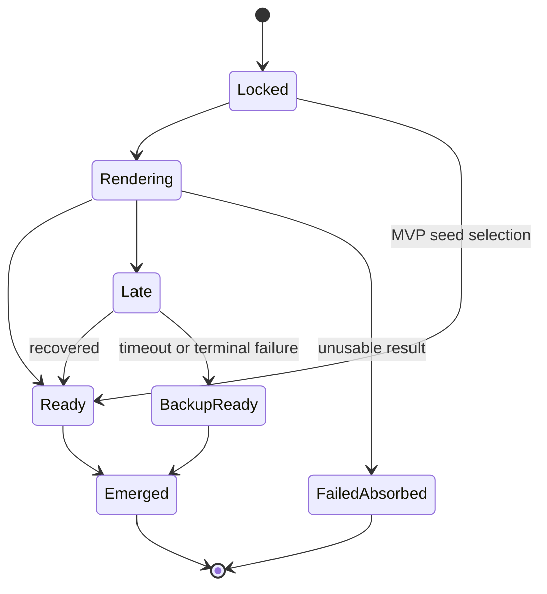

# Technical Design: Video Assets And Generation Pipeline

## Purpose

Define the MVP pre-generated video pool and the V1 generation boundary so the product can prove the social organism before integrating live AI video providers.

## Product Requirements Covered

- MVP uses project-specific pre-generated Strange Dreamz clips, not generic stock clips.
- Clips should be 5-8 second loopable, silent for MVP, manually assigned traits.
- Oldest active pane is replaced in MVP.
- Winning theme combines with current genome at lock-in.
- Original submitted text remains visible alongside infected preview.
- V1 adds real AI video generation, provider abstraction, storage/CDN, moderation, failure recovery, backup emergence, and queue controls.
- Generation lock and emergence are separate moments.
- Delays and failures are visible, diegetic, and honest.

## Pipeline Concepts

| Concept | MVP | V1 |
| --- | --- | --- |
| Source | Pre-generated seed pool | Provider-generated candidates |
| Prompt mutation | Deterministic infected preview from theme plus genome | Provider-ready prompt plus safety metadata |
| Readiness | Clip selected from pool | Candidate can be rendering, late, ready, failed, backed up, or recovered |
| Storage | Local or hosted operational asset pool, to be selected | CDN-backed storage, to be selected |
| Moderation | Visible surface moderation; generation eligibility may be deterministic or locally evaluated | Separate generation safety gate before provider call |
| Emergence | Replace oldest pane with ready seed clip | Replace oldest pane with ready candidate or backup |

## Generation Eligibility

Visible theme eligibility and generation eligibility are separate states.

- A theme that passes visible moderation may remain visible, boostable, and socially meaningful.
- A theme that fails generation safety must be marked "Not eligible for generation" before Lock-In.
- Lock-In should select the highest-ranked generation-eligible theme for prompt mutation and generation. If no generation-eligible theme exists, no prompt enters generation for that cycle and the UI should show an honest no-generation or backup-emergence state.
- The product may later add a social-only win for non-generation-eligible themes, but that would be a product decision and must not be invented during implementation.

## MVP Seed Pool Acceptance

MVP launch requires a project-specific seed pool, not generic stock or test clips. Before using the fake-generation loop for product judgment, define:

- minimum clip count for one awake session and the expected reuse pressure;
- manually assigned trait metadata coverage for subject, style, palette, motion, mood, texture, recurring objects, and audio-vibe metadata where useful;
- selection rules that map genome and lineage inputs to candidate clips;
- reuse cooldown or explicit reuse policy;
- empty, invalid, or exhausted pool behavior;
- launch validation that blocks production if no ready seed or backup clip exists.

Generic clips or deterministic placeholders are acceptable only for developer validation before product evaluation.

## Generation State Model

This illustrates the intended pipeline shape and is directional guidance for review, not implementation specification.

## Prompt Mutation Boundary

Prompt mutation should preserve the original theme's core noun or scene while strongly altering style, mood, palette, texture, motion, and motifs based on current genome.

The mutation boundary should produce:

- Original submitted text.
- Infected preview for users.
- Trait/genome metadata used for lineage and future provider prompts.
- Generation eligibility state.

## First Failing Tests For Future Slices

- MVP seed selection: given an emergence slot and available seed pool, the pipeline returns a ready project-specific clip with trait metadata.
- Empty seed pool: given the seed pool is empty, invalid, or unavailable, emergence does not silently reuse generic content and surfaces a visible operational state.
- Prompt mutation: given a winning theme and dominant genome traits, lock-in produces an infected preview while preserving the original theme text.
- Generation eligibility: given the top visible theme is not generation-eligible and a lower-ranked theme is generation-eligible, Lock-In behavior follows the documented generation-eligible selection rule.
- Oldest-pane replacement: given four active panes and a ready clip, emergence replaces the oldest pane.
- Honest backup: given a locked prompt fails or times out in V1, a backup emergence is identified as backup rather than pretending the user-selected theme generated it.
- Provider boundary: given a moderated prompt in V1, the workflow calls a provider interface and records a candidate without requiring a live provider in tests.
- Burn-in metrics: given provider research mode, the system can record p50, p90, p95, failures, moderation blocks, cost, and usable-loop rate.

## Validation Expectations

- MVP tests should avoid live provider calls entirely.
- Provider tests should use a fake provider contract before live integration.
- Pipeline tests should cover delayed, backup, recovered, failed, and absorbed states before V1 launch.
- Operational checks should prove a sufficient seed pool exists before MVP launch and at least one backup clip is available before real generation is enabled.

## Open Decisions

- First project-specific seed videos.
- Seed clip metadata format.
- Minimum seed pool size, trait coverage, reuse cooldown, and exhaustion policy.
- Storage location for MVP clips.
- V1 provider selection after burn-in.
- Provider timeout threshold before backup emergence.
- CDN/storage model for generated videos.
- Queue and concurrency model.

## Sources

- `docs/plans/PRD_V0.md`
- `docs/plans/initial-roadmap.md`
- `docs/plans/video-generation-latency-research.md`
- `docs/plans/ARCHITECTURE.md`
